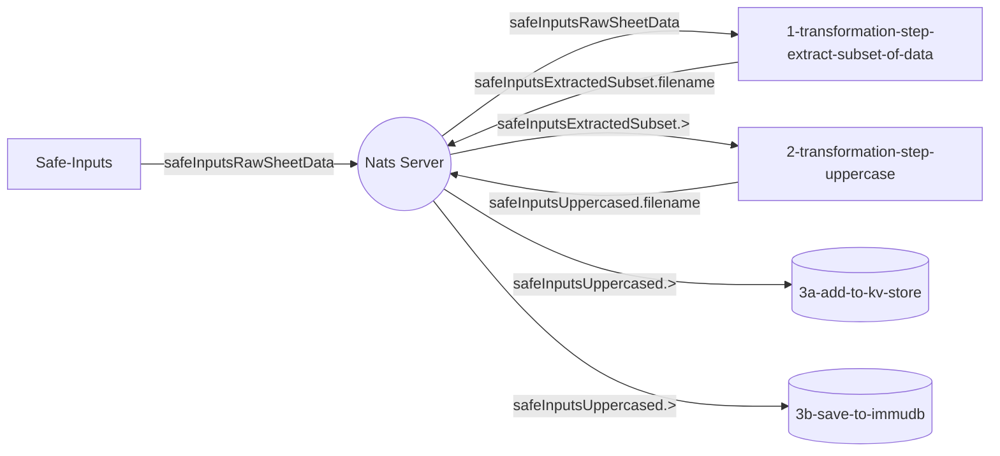

# NATS Data Pipeline Proof-of-Concept

This project explores the use of [NATS](https://nats.io/) for the messaging system, as well as to store data, in a real-time data pipeline.

We're using the data extracted with the [Safe Inputs project](https://github.com/PHACDataHub/safe-inputs/) as the initiation point for this pipeline to transform and move data in an event-driven way. The pipeline is made up of modular (micro) services each perfoming a small function.   

The services communicate with NATS; which is an open-source, cloud-native messaging system by [Synadia](https://synadia.com/). NATS is designed to allow for easy multi-cloud and multi-geo solutions - avoiding vendor lock-in as well as allowing for messaging between the provinces and territories, health units, PHAC and other health organizations, regardless of where they are located and what platform they are using.

The services all connect to the NATS server and subscribe or publish to various 'subjects' (or message streams).  

Here's a [video](https://www.youtube.com/watch?v=hjXIUPZ7ArM&t=1s) providing an overview of NATS. More can be found on the [youtube channel](https://www.youtube.com/@SynadiaCommunications) and in the [docs](https://docs.nats.io/), [repo](https://github.com/nats-io/) and the [nats by example](https://natsbyexample.com/) site.

There are two types of NATS messaging - core NATS (at-most-once delivery or send-and-forget) and [jetstream](https://www.youtube.com/watch?v=EJJ2SG-cKyM) (at-least-once message delivery).  Here we're using NATS jetstream, which stores messages on the NATS server (we can set the retention policy around this), allowing for the message consumers to have insight into the message stream history, and to know which messages they have consumed; ensuring that messages are delivered in order, even with a lost connection.

This pipeline is event-driven with push consumers, and 2 small transformations culminating in storage in a database and datastore. 

*Please note this is a work in progress*

The current flow is initiated with the "upload" of a spreadsheet to https://safeinputs.alpha.canada.ca (the [safe inputs project](https://github.com/PHACDataHub/safe-inputs)) 

* 1-transformation-step-extract-subset-of-data demonstrates a small transformation (extracting out just the data, filename and small amount of metadata from the message - but really other work would be done here too - this is an simplified example). 
* 2-transformation-step-uppercase is another small transformation - where the data is uppercased.
* 3a-add-to-kv-store puts the message into the NATS KV (Key Value) store; in this case using it as a filestore/ database. 
* 3b-save-to-immudb saves the data into a versioning db.  
* api-kv-store is a GraphQL API built as an alternative way to add or retrieve data from the NATS KV Store defined in 3a-add-to-kv-store. (Although the KV Store is also a stream so messages can pulled back out with another consumer!)

## Try it out!
Open up and start each service locally in your command lines of choice and watch the data flow when you "upload" a file to safe inputs. 

Use the Yoga-GraphiQL interface to access the KV Store data and add additional data to the store. 
Running 3a-add-to-kv-store.kv_reader.js runs watch commands and will explore history (update to come on history).

### TODO
* Fix reading History from KV Store
* Use Object Store 
* Add in tests

This repo (will) use the [node-microservices-demo](https://github.com/PHACDataHub/node-microservices-demo) framework.

#### More Links: 
https://docs.nats.io/nats-concepts/jetstream
https://nats.io/blog/nats-server-29-release/
